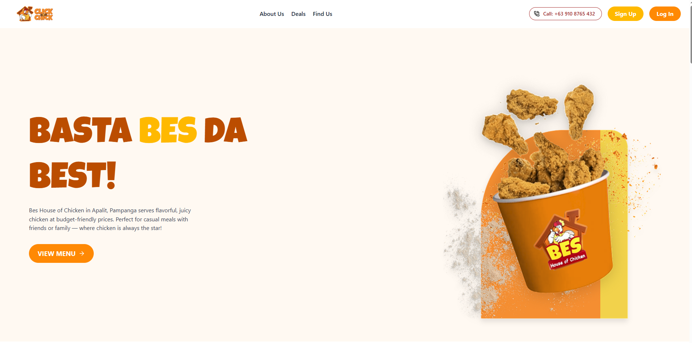

# Chick-N--Click

_A Webapp for Online Ordering in House of Chicken_

---


---

## 🐔 Overview

**Chick-N--Click** is a modern web application powering the online ordering experience for House of Chicken (BES House of Chicken), Apalit, Pampanga. It combines the robustness of Laravel (PHP backend/API), the interactivity of React (frontend), and the real-time capabilities of FastAPI (Python, WebSockets) for a seamless, responsive customer experience.

---

## 🌐 Live Demo

> **Visit our deployed website here:**  
> [https://chick-n-click-uuiw.vercel.app/](https://chick-n-click-uuiw.vercel.app/)

---

## 🌟 Screenshot



---

## 🚀 Features

- 🛒 **Online Menu & Ordering:** Browse the menu, customize your order, and checkout.
- ⚡ **Real-Time Updates:** Orders and menu updates broadcast instantly via WebSockets.
- 👉 **Flexible Order Customization:** Options, add-ons, and easy instructions.
- 🔐 **User Authentication:** Secure signup/login via Laravel Sanctum API.
- 💳 **Checkout:** Multiple payment options (configurable backend).
- 📦 **Order Tracking:** Follow orders from placement to delivery in real time.
- 📊 **Admin Dashboard:** Manage menu, orders, .


---

## 🏗️ Architecture

- **Frontend:** [React](https://react.dev/)  
- **Backend/API:** [Laravel](https://laravel.com/) (PHP, Sanctum for API authentication & token management)
- **Real-time Events:** [FastAPI](https://fastapi.tiangolo.com/) (Python; handles WebSocket broadcasting for instant updates)
- **Authentication:** Laravel Sanctum (SPA and API token security)
- **Containerization/DevOps:** Docker

### Data Flow

1. **User Interacts (React Frontend):**
   - Browses menu, places orders, manages cart, etc.
   - API requests handled via Laravel Sanctum-protected endpoints.

2. **API & Business Logic (Laravel Backend):**
   - Processes business logic, serves data to frontend, manages authentication.
   - Triggers relevant events (order status, menu changes).

3. **Real-Time Broadcasts (FastAPI):**
   - Listens for application events (e.g., new order, order status update).
   - Uses WebSocket connections to push updates instantly to customers and admins.

---

## 🧑‍🍳 Tech Stack Breakdown

- **Languages:** JavaScript (React), PHP (Laravel), Python (FastAPI)
- **API Authentication:** Laravel Sanctum
- **Real-Time:** FastAPI Websockets (Python)
- **DevOps/Provisioning:** Docker, Shell Scripts

---

## 🗺️ Getting Started

### Prerequisites

- [Node.js](https://nodejs.org/) (for React frontend)
- [PHP](https://www.php.net/) 8.x (for Laravel backend)
- [Composer](https://getcomposer.org/) (Laravel dependencies)
- [Python 3.8+](https://www.python.org/) (FastAPI server for WebSockets)
- [Docker](https://www.docker.com/) _(optional: recommended for local dev & deployment)_

---

### Setup Instructions

#### 1. Clone the repository
```bash
git clone https://github.com/7078-cj/Chick-N--Click.git
cd Chick-N--Click
```

#### 2. Laravel Backend/API Setup
```bash
cd backend      # adjust if your backend folder is named differently
composer install

cp .env.example .env
php artisan key:generate

# Update .env with your DB and broadcast configs (see sample below)
php artisan migrate --seed
```


#### 3. React Frontend Setup
```bash
cd ../frontend  # adjust path as required
npm install
npm start       # starts on http://localhost:3000 by default
```
- Update `.env` (or `src/config.js`) with your API endpoints.

#### 4. FastAPI WebSocket Server Setup
```bash
cd ../realtime  # adjust for your FastAPI server folder
python -m venv venv
source venv/bin/activate
pip install -r requirements.txt
uvicorn main:app --reload
```
- Ensure FastAPI is listening at the correct host/port (often http://localhost:8001).
- Configure your frontend and backend to use this endpoint for real-time events.

#### 5. Dockerized Development/Deployment (Optional)
- Use `docker-compose up --build` to launch all services.
- Adjust env values in `docker-compose.yml` as needed.

---

## 🗂️ Project Structure

```text
/
├── backend/        # Laravel API (PHP, Sanctum)
├── frontend/       # React App
├── websockert/       # FastAPI WebSocket server (Python)
├── docker-compose.yml         # Docker compose to build the container
├── assets/         # Images, screenshots for docs
├── README.md
└── ...
```

---

## 📄 License

MIT License

---

## 📫 Contact

- [GitHub Issues](https://github.com/7078-cj/Chick-N--Click/issues) for bug reports/support
- Project owner: [7078-cj](https://github.com/7078-cj)

---
